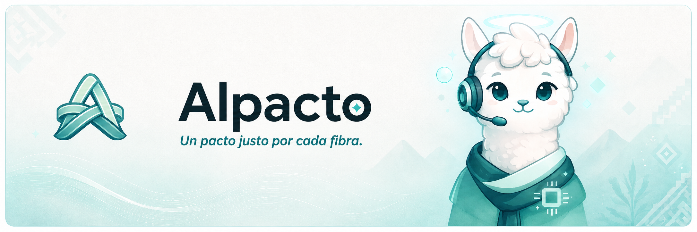

# Alpacto



Alpacto is a Web 2.5 fair-trade platform for alpaca fiber settlement. Buyers lock USDC in on-chain escrow, associations register lots, inspectors submit evidence, the Ayni auditor agent attests findings, and producers accept settlement before fiber is released. Crypto complexity is hidden behind ZeroDev smart accounts; settlement rules run on **Arbitrum Sepolia** via a Stylus (`AlpactoCore`) contract.

The API is the policy and orchestration authority. PostgreSQL is the off-chain source of truth for UX state. Private keys for treasury and server-side session signing stay on the API/worker — browsers never receive them.

## Start here

### Fastest path: full Docker stack

Prerequisites: Node.js 22+, Yarn 3.2.3 (repo-pinned), Docker Engine with Compose v2.

```bash
cp infra/docker/.env.example infra/docker/.env
# Fill public URLs, JWT_SECRET, ZeroDev, ALPACTO_CONTRACT_ADDRESS, treasury, Stripe (test), AI keys
yarn docker:stack
```

On first boot with an empty Postgres volume, `bootstrap` runs `db:seed` and `seed:wallets` automatically (wallets need `ZERODEV_PROJECT_ID` + `ZERODEV_BUNDLER_RPC`). Later restarts skip bootstrap when demo wallets already exist.

Open:

- Web: http://localhost:3000
- API health: http://localhost:4000/health
- MinIO console: http://localhost:9001

For local Node iteration, VPS/Dokploy, and troubleshooting, read [Getting Started](docs/GETTING_STARTED.md) and [Operations](docs/OPERATIONS.md).

## Documentation index

README is the entry point. Continue with the document that matches the work you are doing:

| Document | Use it when you need to… |
| --- | --- |
| [Architecture](docs/ARCHITECTURE.md) | Understand services, trust boundaries, request flows, and data ownership |
| [Getting Started](docs/GETTING_STARTED.md) | Install, start, verify, and troubleshoot a local stack |
| [Configuration](docs/CONFIGURATION.md) | Configure env vars, secrets, and public URLs |
| [Arbitrum](docs/ARBITRUM.md) | Sepolia, Stylus, USDC, ZeroDev, RPC, on-chain flows, explorers |
| [Ayni](docs/AYNI.md) | Audit worker, closed tool set, session keys, role chats |
| [Operations](docs/OPERATIONS.md) | VPS/Dokploy, bootstrap, logs, resets, Stripe CLI in Docker |
| [Testing](docs/TESTING.md) | Run automated checks and a manual smoke test |
| [Security](docs/SECURITY.md) | Review credential boundaries and MVP hardening |
| [Demo](docs/DEMO.md) | Run the 5-minute end-to-end walkthrough |
| [Product specification](ALPACTO_PRD.md) | Read detailed product, UX, and MVP decisions |
| [Technical decisions](DECISIONS.md) | See dated implementation decisions |

## Product model

Alpacto combines five capabilities:

1. **Role UX** — producer, inspector, association, buyer, and admin surfaces in `apps/web`.
2. **Escrow funding** — Stripe test Checkout (MVP) credits a funding intent; the buyer Kernel SA funds `AlpactoCore` with Circle test USDC on Arbitrum Sepolia.
3. **Evidence pipeline** — inspections upload scale/classification evidence to MinIO; Ayni runs OCR + deterministic settlement math.
4. **On-chain rules** — Stylus `AlpactoCore` on Arbitrum Sepolia for orders, lots, attestations, and settlement.
5. **ZeroDev accounts** — Kernel smart accounts + paymaster so producers never use MetaMask or pay gas.

## Roles

| Role | Seed login (after bootstrap) | Typical actions |
| --- | --- | --- |
| Buyer | `andes@demo.alpacto` | Create/fund orders |
| Association | `alpasur@demo.alpacto` | Register lots against funded orders |
| Inspector | `carlos@demo.alpacto` | Submit inspection weight + evidence |
| Producer | `martina@demo.alpacto` | Review audit, request reweigh, accept settlement |
| Admin | `admin@demo.alpacto` | Ops / platform views |

Producer registration also supports live ZeroDev Google, Email OTP, and Passkey (creates a different Kernel wallet than the Martina seed).

## Runtime topology

```text
Browser (Next.js :3000)
        │ HTTPS / local
        ▼
API (Fastify :4000) ──── PostgreSQL :5432
        │                   Redis :6379
        │                   MinIO :9000
        │ BullMQ
        ▼
Ayni worker ──────────── Vision (required for demo) + DeepSeek orchestrator
        │                 fixture mode or live OpenAI OCR
        ├── ZeroDev bundler / paymaster ──► Arbitrum Sepolia
        └── AlpactoCore (Stylus) + Circle test USDC
```

See [Architecture](docs/ARCHITECTURE.md) for trust boundaries and request flows. See [Arbitrum](docs/ARBITRUM.md) for chain services and signers.

## Repository map

```text
apps/
  web/           Next.js product UX
  api/           Fastify API (auth, Stripe, lots, settlements, Ayni chat)
  ayni-worker/   BullMQ Ayni audit consumer
packages/
  contracts/     Stylus crates (alpacto-core, mock-usdc) + deploy tooling
  database/      Drizzle schema, migrations, seed, first-boot bootstrap
  domain/        Integer money / settlement helpers
  shared-schemas/ Zod API schemas
  zero-dev/      Kernel, paymaster, session-key helpers + seed wallets
infra/docker/    Compose stack (Postgres, Redis, MinIO, migrate, bootstrap, api, ayni, web, Stripe CLI)
docs/            Maintainer documentation
nitro-devnode/   Local Stylus chain for contract unit/dev deploys
```

## Development commands

```bash
yarn install
yarn docker:stack          # full stack (preferred)
yarn docker:up             # same compose file, no rebuild
yarn docker:logs           # api + web + ayni
yarn docker:down

# Local Node (infra containers only for DB/Redis/MinIO)
yarn api:dev
yarn ayni:dev
yarn web:dev               # or yarn start

yarn db:migrate
yarn db:seed
yarn seed:wallets
yarn fund-demo-buyer

yarn domain:test
yarn api:test
yarn stylus:test
yarn web:check-types
yarn test                  # domain + api + stylus
```

Contract deploy (local Nitro or Sepolia) is documented in [Arbitrum](docs/ARBITRUM.md).

## Project status and scope

The repository is a production-shaped MVP. Current scope includes:

- role-based product UX and demo seed logins;
- Stripe test Checkout → buyer Kernel → Sepolia escrow;
- inspection evidence (browser → API → MinIO) + Ayni audit with **required** vision step (fixture or live OpenAI);
- admin Users directory (emails, Kernel addresses, on-chain USDC) for demo verification;
- producer settlement accept / reweigh with session keys or seed Kernel;
- full Docker Compose deploy with first-boot bootstrap.

The current MVP does not include:

- production TLS, secret managers, or rate limiting by default;
- live fiat on-ramp (Stripe is sandbox for demos);
- official physical metrology (Ayni OCR is assistive);
- multi-tenant organizer identity beyond demo roles.

Intentional limitations and history live in [ALPACTO_PRD.md](ALPACTO_PRD.md) and [DECISIONS.md](DECISIONS.md).

## Verification

Before opening a pull request or demoing a change:

```bash
yarn web:check-types
yarn domain:test
yarn api:test              # needs Postgres up + seed (see Testing)
yarn stylus:test
```

Then run the smoke path in [Testing](docs/TESTING.md) and/or the walkthrough in [Demo](docs/DEMO.md).

## Documentation conventions

- Keep README as the navigation index and high-level contract.
- Put detailed operational or architectural material in `docs/`.
- Keep product decisions in `ALPACTO_PRD.md`.
- Keep dated engineering decisions in `DECISIONS.md`.
- Maintainer docs are **English**. Runtime Ayni knowledge under `apps/api/content/` may remain Spanish for end users.
- Update links and verification commands when runtime behavior changes.
