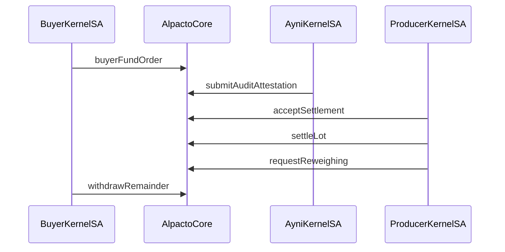

# Arbitrum

This document is the Arbitrum track guide for Alpacto: which network and services we use, how Stylus and ZeroDev fit together, who signs what, and which on-chain flows the product triggers.

## Quick path

1. Use **Arbitrum Sepolia** (`421614`) for all Kernel / escrow / attestation demos.
2. Point `ALPACTO_CONTRACT_ADDRESS` at the deployed Stylus core (see below).
3. Configure ZeroDev bundler + paymaster and `ARBITRUM_RPC_URL`.
4. Run `yarn seed:wallets` (or Docker bootstrap) so demo users have Kernel addresses.
5. Verify UserOps and txs on [Arbiscan Sepolia](https://sepolia.arbiscan.io).

## Network and execution

| Environment | Chain id | Purpose |
| --- | ---: | --- |
| **Arbitrum Sepolia** | `421614` | MVP settlement, AA, Circle test USDC |
| **Nitro DevNode** (local) | `412346` | Stylus compile/deploy unit path (`yarn chain`) — **not** used for ZeroDev demos |

Product AA (Kernel, paymaster, session keys) targets Sepolia only. Nitro + `mock-usdc` exist for contract development and `yarn phase1`.

## Deployed core (Sepolia)

Canonical registry: `apps/web/contracts/deployedContracts.ts` under chain `421614`.

| Contract | Address | Explorer |
| --- | --- | --- |
| `alpacto-core` | `0x3d9c424814a9038ba7d4dd39c1e6a1bb58a3fc5f` | [Arbiscan](https://sepolia.arbiscan.io/address/0x3d9c424814a9038ba7d4dd39c1e6a1bb58a3fc5f) |

Set the same value in `.env` / `infra/docker/.env` as `ALPACTO_CONTRACT_ADDRESS`. Older demo cores are obsolete; do not mix orders across redeploys.

Circle test USDC (6 decimals):

```text
USDC_TOKEN_ADDRESS=0x75faf114eafb1BDbe2F0316DF893fd58CE46AA4d
```

## Arbitrum / ecosystem services we use

| Service | Role in Alpacto |
| --- | --- |
| **Arbitrum Sepolia L2** | Escrow, roles, attestations, settlement |
| **Stylus (Arbitrum)** | Runtime for Rust `alpacto-core` via `cargo-stylus` |
| **Circle test USDC** | Escrow asset transferred into/out of the core |
| **ZeroDev** | Kernel smart accounts, bundler UserOps, paymaster gas policy, session keys |
| **RPC** | `ARBITRUM_RPC_URL` (Alchemy or public); `@alpacto/zero-dev` falls back to public Sepolia RPC when primary flaps |
| **Arbiscan Sepolia** | Address/tx verification for demos and ops |

We do **not** use WalletConnect / RainbowKit scaffold connectors in the product UI. Producer auth is ZeroDev wallet-react (Google / OTP / Passkey) or demo seed Kernel.

## Stylus contracts

| Crate | Path | Purpose |
| --- | --- | --- |
| `alpacto-core` | `packages/contracts/contracts/alpacto-core/` | Orders, lots, escrow USDC, inspections, attestations, settlement, remainder withdrawal |
| `mock-usdc` | `packages/contracts/contracts/mock-usdc/` | Mintable ERC20 for **local Nitro only** |

Constructor: `alpacto-core(admin, usdcToken)`. On Sepolia deploy, pass Circle USDC (no mock).

### Roles (AccessControl)

| Role | Typical callers |
| --- | --- |
| `DEFAULT_ADMIN_ROLE` | Deploy admin |
| `PLATFORM_ADMIN_ROLE` | Treasury / legacy `fundOrder` |
| `BUYER_ROLE` | `createOrder`, `buyerFundOrder`, `withdrawRemainder` |
| `ASSOCIATION_ROLE` | `registerLot` |
| `INSPECTOR_ROLE` | `registerLot`, `submitInspectionReference` |
| `AUDITOR_AGENT_ROLE` | `submitAuditAttestation` only |

Lot producer may `requestReweighing`, `acceptSettlement`, and `settleLot`.

### Public surface (summary)

```text
createOrder(orderId, buyer, association, pricingPolicyHash, budgetUsdcUnits, targetWeightGrams)
fundOrder(orderId, amount, paymentReferenceHash)              // PLATFORM_ADMIN
buyerFundOrder(orderId, amount, paymentReferenceHash)         // BUYER == order.buyer
registerLot(orderId, lotId, producerAccount)
submitInspectionReference(lotId, version, weightGrams, categoryCode, evidenceHash)
submitAuditAttestation(lotId, version, reportHash, result)
requestReweighing(lotId, reasonHash)
acceptSettlement(lotId, version, quoteHash, netPenMinor, producerUsdcUnits, associationUsdcUnits, platformUsdcUnits)
settleLot(lotId)
withdrawRemainder(orderId)                                    // buyer; leftover escrow after capacity fulfilled

getOrder / getLot / getAuditAttestation
```

`targetWeightGrams` is required (`> 0`). Capacity tracking uses reserved/fulfilled grams. `withdrawRemainder` returns leftover USDC to the **buyer** when fulfilled ≥ target, reserved == 0, and remaining USDC > 0.

IDs (`orderId`, `lotId`) are caller-provided `uint256` values for off-chain correlation.

### Local Stylus verification

```bash
yarn chain          # Nitro
yarn deploy         # mock-usdc then alpacto-core
yarn phase1         # happy path
yarn phase1 -- --flow=reweigh
yarn stylus:test
```

```bash
yarn deploy --network sepolia
yarn export-abi
```

ABIs/addresses land in `apps/web/contracts/deployedContracts.ts`.

## ZeroDev on Arbitrum Sepolia

| Piece | Env / source |
| --- | --- |
| Project | `ZERODEV_PROJECT_ID`, `NEXT_PUBLIC_ZERODEV_PROJECT_ID` |
| Bundler | `ZERODEV_BUNDLER_RPC` |
| Paymaster | `ZERODEV_PAYMASTER_RPC` (enable Gas Policy on Sepolia in dashboard) |
| Seed Kernels | `yarn seed:wallets` + `DEMO_WALLET_SEED` |
| Ayni session | `AYNI_SESSION_KEY`, `AYNI_SMART_ACCOUNT`, `AYNI_SERIALIZED_SESSION` (`yarn ayni:session`) |
| Producer session | API prepare/complete grant; policies for accept/settle/reweigh |

Kernel versions: Ayni stays on v3.1-style session path; Google producer wallets may use Kernel v3.3 (wallet-react). See `DECISIONS.md` for the mismatch fix that introduced producer session keys.

## Who signs what

| Actor | Key material | On-chain actions |
| --- | --- | --- |
| Treasury EOA | `TREASURY_PRIVATE_KEY` | Role grants, USDC/ETH top-ups, some admin paths |
| Buyer seed Kernel | Derived from `DEMO_WALLET_SEED` for `andes@` | `approve` + `buyerFundOrder` |
| Association / inspector seeds | Same seed derivation | `registerLot`, inspection refs (when wired on-chain) |
| Producer seed or live Kernel | Martina seed **or** ZeroDev Google/OTP + session grant | `requestReweighing`, `acceptSettlement`, `settleLot` |
| Ayni Kernel | `AYNI_*` session | `submitAuditAttestation` only |

Same `DEMO_WALLET_SEED` ⇒ same Kernel addresses locally and on VPS ⇒ USDC already on that Sepolia address remains available.

## On-chain flows ↔ application modules



| Flow | Trigger | Primary code |
| --- | --- | --- |
| Fund escrow | Stripe webhook → fund job | `apps/api` funding + `lib/buyer-funding.ts` |
| Register lot | Association UI | `lib/register-lot-onchain.ts` |
| Inspection | Inspector UI | `lib/submit-inspection-onchain.ts` |
| Audit attest | Ayni worker | `apps/ayni-worker` pipeline + zero-dev session client |
| Reweigh | Producer UI | `lib/request-reweigh-onchain.ts` |
| Settlement | Producer accept | `lib/settlement-onchain.ts` + producer session signer |

RPC transport prefers `ARBITRUM_RPC_URL` with public Sepolia fallback (`createPublicRpcTransport` in `@alpacto/zero-dev`).

## Ops commands

```bash
yarn seed:wallets
yarn fund-demo-buyer -- --amount 90
yarn set-platform-treasury
yarn settle-demo-lot
yarn ayni:session
yarn phase3          # sponsored Sepolia checkpoint script
```

Owner keys for seed wallets are written to `.secrets/demo-wallets.json` (gitignored). Do not commit or film them.

## Related documents

- [Architecture](ARCHITECTURE.md)
- [Configuration](CONFIGURATION.md)
- [Ayni](AYNI.md)
- [Demo](DEMO.md)
- [Technical decisions](../DECISIONS.md)
