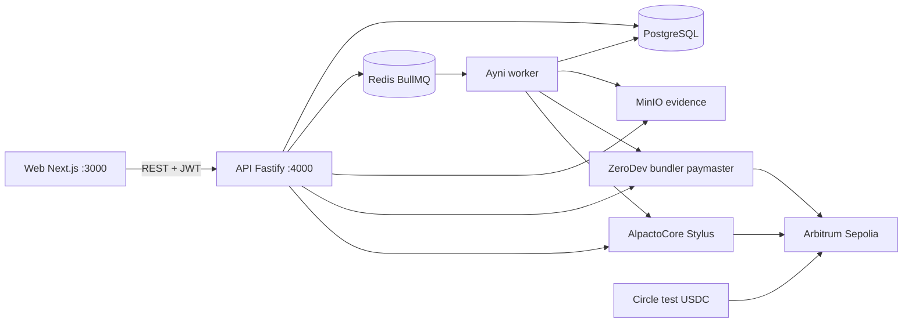
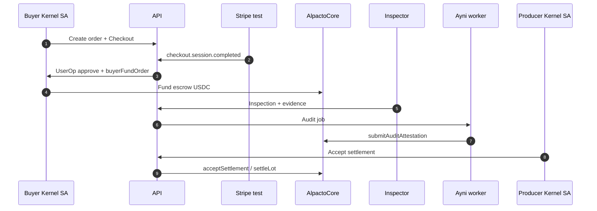

# Architecture

Alpacto separates browser UX, API orchestration, async audit work, object storage, and Arbitrum Sepolia settlement. PostgreSQL is the off-chain system of record for product state; `AlpactoCore` is the on-chain settlement authority.

## Quick path

1. Read the runtime topology below.
2. Follow funding → inspection → Ayni → settlement.
3. Use [Configuration](CONFIGURATION.md) for env vars and [Arbitrum](ARBITRUM.md) for chain services.

## System context

## Runtime components

| Component | Port | Responsibility | Owns secrets? |
| --- | ---: | --- | --- |
| `apps/web` | 3000 | Role UX, producer ZeroDev auth UI | No (only `NEXT_PUBLIC_*`) |
| `apps/api` | 4000 | Auth, Stripe webhooks, lots/orders, settlement orchestration, Ayni chat | Yes: JWT, Stripe, treasury, S3, AI keys, producer session material |
| `apps/ayni-worker` | — | BullMQ audit pipeline, vision OCR, attestation UserOps | Yes: DB, S3, OpenAI/DeepSeek, `AYNI_*` session |
| PostgreSQL | 5432 | Users, orgs, orders, lots, audits, settlements | DB credentials |
| Redis | 6379 | BullMQ queues | Optional password (none in MVP compose) |
| MinIO | 9000 / 9001 | Evidence objects + console | S3 access keys |
| Stripe CLI (compose) | — | Forwards test webhooks to `api:4000` | Stripe secret key |
| `@alpacto/zero-dev` | — | Kernel clients, paymaster, session helpers | Used by API/worker with env secrets |
| `packages/contracts` | — | Stylus `alpacto-core` + local `mock-usdc` | Deploy keys in env |

### API

The API:

- issues JWTs for demo login and producer ZeroDev sessions;
- creates orders / funding intents and handles Stripe `checkout.session.completed`;
- triggers on-chain funding via buyer Kernel SA UserOps;
- accepts inspection submissions and enqueues Ayni audits;
- gates settlement accept on audit `pass` / `warning`;
- hosts role-scoped Ayni chat endpoints.

### Ayni worker

Ayni is a **read-and-attest** agent. It loads lot context, runs vision extraction (fixture or OpenAI), compares declared vs observed values with deterministic domain math, persists an audit report, and submits `submitAuditAttestation` when an on-chain lot id exists. It never transfers USDC or ETH.

### Web

Product routes live under `(fullscreen)` (landing, login, producer auth) and `(product)` (role dashboards). There is no Scaffold `/debug` or `/blockexplorer` UI.

## Request flows

### Buyer funds an order (Stripe → escrow)

1. Buyer creates an order in the UI (API + Postgres).
2. Buyer starts Checkout; Stripe sandbox completes.
3. Webhook `POST /webhooks/stripe` verifies signature and marks the funding intent paid.
4. BullMQ / API path has the buyer Kernel SA `approve` USDC and call `buyerFundOrder` on `AlpactoCore`.
5. Postgres order status becomes funded / accepting lots; Arbiscan shows escrow.

### Inspection → Ayni audit

1. Inspector submits weight, category, and evidence hashes (MinIO uploads via presigned URLs).
2. API stores inspection and enqueues an audit job.
3. Ayni extracts OCR values, compares with 1% weight tolerance, writes `audit_runs` / findings.
4. If on-chain lot exists, Ayni session key submits `submitAuditAttestation`.
5. Lot moves to `ready_for_review` or `review_required` (or similar DB statuses mapped from audit result).

### Producer settlement

1. Producer reviews lot + audit (Martina seed Kernel or live ZeroDev wallet with session grant).
2. `POST /lots/:id/settlement/accept` is rejected unless latest audit is `pass` or `warning`.
3. Server/session client calls `acceptSettlement` then `settleLot` (or local payout simulation when `DEMO_LOCAL_PAYOUT_ENABLED`).
4. Escrow USDC splits move on-chain when fully wired; remanente withdrawal uses `withdrawRemainder` for buyers when capacity is fulfilled.

## Data ownership

| Data | Source of truth |
| --- | --- |
| Users, orgs, campaigns, pricing policies | PostgreSQL |
| Orders / lots UX status, audits, disputes | PostgreSQL |
| Evidence blobs | MinIO (`S3_BUCKET`) |
| Escrow balances, attestations, settlement splits | `AlpactoCore` on Arbitrum Sepolia |
| Kernel addresses for seed users | PostgreSQL `users.smart_account_address` (from `seed:wallets`) |
| Deployed ABI/address registry for admin | `apps/web/contracts/deployedContracts.ts` |

## Trust boundaries

- Browser is untrusted: only `NEXT_PUBLIC_API_URL` and `NEXT_PUBLIC_ZERODEV_PROJECT_ID` are client-visible by design.
- `TREASURY_PRIVATE_KEY`, Stripe secrets, JWT secret, Ayni session material, and S3 keys stay in server env.
- Ayni cannot move funds (call policy + `AUDITOR_AGENT_ROLE` attestation-only).
- Producer session keys are limited to `acceptSettlement`, `settleLot`, and `requestReweighing` on the core contract.
- Compose publishes Postgres/Redis/MinIO ports for MVP convenience — harden before public VPS exposure ([Security](SECURITY.md)).

## Related documents

- [Getting Started](GETTING_STARTED.md)
- [Configuration](CONFIGURATION.md)
- [Arbitrum](ARBITRUM.md)
- [Ayni](AYNI.md)
- [Operations](OPERATIONS.md)
- [Security](SECURITY.md)
- [Product specification](../ALPACTO_PRD.md)
