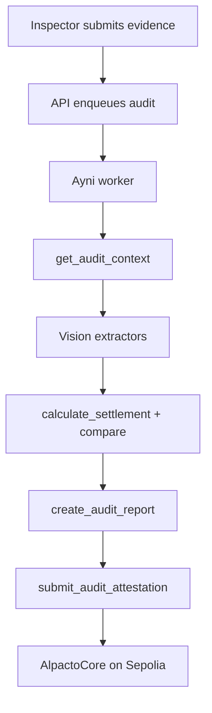

# Ayni

Ayni is Alpacto’s audit agent. It reviews inspection evidence, compares declared vs observed values with deterministic math, and submits an on-chain attestation when a lot is registered on `AlpactoCore`. Ayni **never moves funds**.

## Quick path

1. Configure `AYNI_*` session material (`yarn ayni:session`) and `ALPACTO_CONTRACT_ADDRESS`.
2. Set `AYNI_USE_FIXTURE_VISION=true` for demos without OpenAI, or provide `OPENAI_API_KEY` for live vision.
3. Run `yarn ayni:dev` (or the `ayni` Compose service) alongside the API.
4. Submit an inspection from the inspector UI — the API enqueues a BullMQ job.
5. Watch lot timeline / Ayni live modal for progress and result.

## Runtime

| Piece | Role |
| --- | --- |
| BullMQ queue | API enqueues; `apps/ayni-worker` consumes |
| DeepSeek | Tool-calling orchestrator (when not short-circuited) |
| OpenAI vision | Scale + classification OCR (unless fixture mode) |
| `@alpacto/domain` | Integer settlement / comparison math |
| ZeroDev session | `submitAuditAttestation` UserOp only |

## Closed tool set

| Tool | Purpose |
| --- | --- |
| `get_audit_context` | Load lot, inspection, pricing, evidence metadata |
| `extract_scale_evidence` | Vision OCR on scale photo |
| `extract_classification_document` | Vision OCR on classification doc |
| `calculate_settlement` | Deterministic integer math via `@alpacto/domain` |
| `compare_audit_values` | Declared vs observed; **1%** weight tolerance |
| `create_audit_report` | Persist `audit_runs` / `audit_findings` + report hash |
| `submit_audit_attestation` | ZeroDev session UserOp (attestation only) |

The LLM may only invoke these tools. Financial calculations are forbidden in the model layer.

## Session key limits

- Material: `AYNI_SESSION_KEY`, `AYNI_SMART_ACCOUNT`, `AYNI_SERIALIZED_SESSION`
- Call policy: **only** `submitAuditAttestation` on `ALPACTO_CONTRACT_ADDRESS`
- No ETH or ERC-20 transfers
- Requires `AUDITOR_AGENT_ROLE` on the Ayni smart account

Revoke: `POST /admin/ayni/session-key/revoke`.

## Fixture vs live vision

| Mode | Env | Behavior |
| --- | --- | --- |
| Fixture | `AYNI_USE_FIXTURE_VISION=true` | Repo fixtures (e.g. 42.5 kg declared vs 41.5 observed → review) |
| Live | `false` + `OPENAI_API_KEY` | Calls configured vision model |

`yarn phase5` exercises the fixture mismatch path and settlement gate.

## Resume / reliability

The worker can resume attestation when a report hash / result already exists (avoids rewinding OCR on BullMQ retries). RPC uses Alchemy/primary with public Sepolia fallback. See `DECISIONS.md` and recent Ayni fixes for attest retry behavior.

## Role chats (API)

Separate from the audit worker, the API hosts Ayni chat helpers for producers, buyers, and associations. Knowledge markdown under `apps/api/content/` is **runtime product copy** (Spanish for end users) and is not part of the English maintainer docs set.

Chats must not reveal other tenants’ data, Stripe secrets, or admin panels.

## Settlement interaction

Producers (or ops roles in demos) call settlement accept on the API. The API rejects accept unless the latest audit result is `pass` or `warning`. `review_required` / `unreadable` block payout.

## Related documents

- [Security](SECURITY.md)
- [Arbitrum](ARBITRUM.md)
- [Architecture](ARCHITECTURE.md)
- [Demo](DEMO.md)
- [Testing](TESTING.md)
