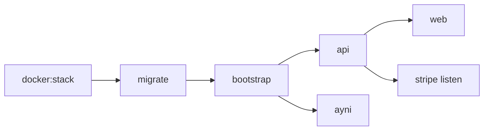

# Operations

Routine operation for local Docker and VPS / Dokploy deployments: health checks, bootstrap behavior, logs, Stripe CLI forwarding, and safe resets.

## Quick path

```bash
yarn docker:stack
yarn docker:logs
curl http://localhost:4000/health
```



## Compose services

| Service | Role |
| --- | --- |
| `postgres` | Primary database volume `alpacto_pg_data` |
| `redis` | BullMQ |
| `minio` / `minio-init` | Evidence bucket; `minio-init` is Alpine+mc (creates bucket); CORS via `MINIO_API_CORS_ALLOW_ORIGIN` |
| `migrate` | One-shot Drizzle migrate |
| `bootstrap` | First-boot `db:seed` + `seed:wallets` (or skip) |
| `stripe-whsec` | Writes CLI webhook signing secret to a shared volume |
| `api` | Fastify API |
| `stripe` | Long-running `stripe listen → http://api:4000/webhooks/stripe` |
| `ayni` | Audit worker |
| `web` | Next.js standalone |
| `seed` | Optional profile for manual DB seed |

## First boot vs later restarts

On an **empty Postgres volume**, after migrate, `bootstrap`:

1. Runs `yarn workspace @alpacto/database seed`
2. Runs `yarn seed:wallets` when `ZERODEV_PROJECT_ID` and `ZERODEV_BUNDLER_RPC` are set

On later `up` / redeploys, if `martina@demo.alpacto` already has `smart_account_address`, bootstrap prints a skip message and exits 0.

| Control | Effect |
| --- | --- |
| `SKIP_BOOTSTRAP=1` | Never seed/wallets on boot |
| `DEMO_WALLET_SEED` empty | Uses `alpacto-local-demo-wallet-seed-v1` |
| Same seed as local | Same Kernel addresses → same on-chain USDC balances |

Manual re-seed (does not wipe wallets by itself):

```bash
yarn docker:seed
# or destructive mock txs:
SEED_RESET_TRANSACTIONS=1 yarn db:seed
```

## Health

| Check | Command / URL |
| --- | --- |
| API | `GET /health` |
| Compose | `docker compose -f infra/docker/docker-compose.yml --env-file infra/docker/.env ps` |
| Postgres | container healthcheck `pg_isready` |
| Redis | `redis-cli ping` |

## Logs

```bash
yarn docker:logs
docker compose -f infra/docker/docker-compose.yml --env-file infra/docker/.env logs -f bootstrap api ayni web stripe
```

## VPS / Dokploy

1. Clone the repo on the VPS.
2. Copy `infra/docker/.env.example` → `infra/docker/.env`.
3. Set public URLs to your IP or domain:

```dotenv
APP_URL=https://your.domain
API_URL=https://api.your.domain
NEXT_PUBLIC_API_URL=https://api.your.domain
S3_PUBLIC_ENDPOINT=https://files.your.domain
```

4. Fill secrets (JWT, ZeroDev, contract, treasury, Stripe test, Ayni session).
5. `yarn docker:stack` (or Dokploy equivalent pointing at the same compose file).

### Dokploy domains vs Compose host ports

These are **two different layers**:

| Layer | What it is | Example |
| --- | --- | --- |
| **Container port** (Dokploy Domain UI) | Port the app listens on **inside** the container | Web `3000`, API `4000` |
| **Host port** (`WEB_PORT`, `API_PORT` in compose) | Port published on the VPS `0.0.0.0` | `3000:3000` on the host |

Dokploy already uses port `3000` on the host. If compose also maps `WEB_PORT=3000`, deploy fails with `port is already allocated`.

**Recommended for Dokploy (domains + HTTPS):** use the Dokploy override so nothing binds host ports:

```bash
docker compose \
  -f infra/docker/docker-compose.yml \
  -f infra/docker/docker-compose.dokploy.yml \
  up -d --build
```

In Dokploy Domain settings:

| Service | Host | Container port |
| --- | --- | --- |
| `web` | `alpacto.your.domain` | `3000` |
| `api` | `api.alpacto.your.domain` | `4000` |

Set env to match:

```dotenv
APP_URL=https://alpacto.your.domain
API_URL=https://api.alpacto.your.domain
NEXT_PUBLIC_API_URL=https://api.alpacto.your.domain
```

Rebuild **web** after changing `NEXT_PUBLIC_API_URL`.

**Quick workaround (no override):** pick free host ports — `WEB_PORT=3002`, `API_PORT=4002` — and still use Dokploy domains (container ports stay `3000` / `4000`).

Dokploy / public URLs are for **browsers**. Inside Compose, services use Docker DNS (`api`, `minio`, `postgres`).

### URL rules

| Variable | Reachable from |
| --- | --- |
| `NEXT_PUBLIC_API_URL` | Browser (rebuild web if changed) |
| `S3_PUBLIC_ENDPOINT` | Optional (console / legacy); uploads use API → `S3_ENDPOINT` |
| `S3_ENDPOINT` | Containers (`http://minio:9000`) |
| `DATABASE_URL` / `REDIS_URL` | Containers |

### Stripe webhooks (MVP automatic)

With `STRIPE_SECRET_KEY` set, `STRIPE_WEBHOOK_SECRET` empty, and `STRIPE_USE_CLI=1` (Compose default — you do not need to set it explicitly):

1. `stripe-whsec` runs `stripe listen --print-secret`
2. API loads that `whsec` from the shared volume
3. `stripe` forwards events to `http://api:4000/webhooks/stripe`

No manual copy/paste. Keep **test** keys for the MVP. Do **not** paste a Dashboard `whsec` while CLI mode is on (signature mismatch).

### Evidence uploads

Inspector UI uses `POST /evidence/upload` (API writes to MinIO). If audits fail with `NoSuchKey`, the object never landed in the bucket — check API logs for storage errors and that `S3_*` keys match across `api`, `ayni`, and `minio`.

### Admin Users

Admin → **Users** lists emails, Kernel addresses, wallet-origin hint, and on-chain USDC for jury verification of seed vs live wallets.

Dashboard endpoint later:

```dotenv
STRIPE_WEBHOOK_SECRET=whsec_from_dashboard
STRIPE_USE_CLI=0
```

### Ports

Compose publishes `3000`, `4000`, `5432`, `6379`, `9000`, `9001` by default for MVP convenience. On a public VPS, prefer binding Postgres/Redis/MinIO console to localhost only (or remove host ports) and terminate HTTPS in front of web/API.

## Safe stop and wipe

```bash
yarn docker:down
# Destructive — deletes Postgres + MinIO volumes:
docker compose -f infra/docker/docker-compose.yml --env-file infra/docker/.env down -v
```

After a volume wipe, the next `docker:stack` runs first-boot bootstrap again.

## Contract / wallet ops

See [Arbitrum](ARBITRUM.md) for:

- `yarn deploy` / `yarn export-abi`
- `yarn seed:wallets` / `yarn fund-demo-buyer`
- `yarn set-platform-treasury`

## Related documents

- [Getting Started](GETTING_STARTED.md)
- [Configuration](CONFIGURATION.md)
- [Security](SECURITY.md)
- [Demo](DEMO.md)
